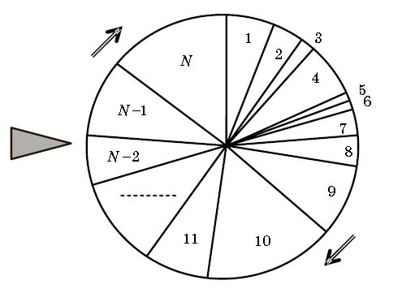

# Вопрос 24: Виды селекции в ГА: турнирный и пропорциональный отборы, стохастический универсальный отбор.

*Селекция* (другие названия – отбор, репродукция) – это первая генетическая операция, осуществляемая над популяцией. В результате селекции должны быть отобраны хромосомы, которые будут участвовать в процессе генерации новой популяции (популяции потомков). Селекция происходит на основании оценок пригодности хромосом. В итоге возникает промежуточная популяция (mating pool или родительский пул). Промежуточная популяция — это набор особей, которые получили право размножаться. Приспособленные особи могут быть записаны туда несколько раз. «Плохие» особи с большой вероятностью туда вообще не попадут.
В классическом ГА вероятность Pi каждой i-й особи попасть в промежуточную популяцию пропорциональна отношению ее ФП к сумме ФП всех хромосом:
\\[ \P_i = \frac{ФП_i}{sum_{i=1}^N ФП_i} \\]
Такой способ носит название пропорциональный отбор (proportional selection). Его можно реализовать следующим образом: пусть особи располагаются на колесе рулетки так, что размер сектора Si (в процентах) каждой особи соответствует Pi: Si = Pi·100%.

Изначально промежуточная популяция пуста. Затем рулетка запускается N раз, так что каждый раз выбирается хромосома, сектор которой оказался под указателем. В итоге выбирается N особей для записи в промежуточную популяцию. Ни одна выбранная особь не удаляется с рулетки, что позволяет ей много раз претендовать на место в промежуточной популяции. После селекции выполняются операции скрещивания и мутации, которые обобщенно называют рекомбинацией.

**Стохастический отбор**

Простейшим методом селекции является метод колеса рулетки (стохастический отбор с заменой – stochastic sampling). Стохастический отбор с заменой можно описать и без использования аналогии с колесом рулетки.

**Турнирная селекция**

Из популяции, содержащей *N* хромосом, выбирается случайным образом *t* хромосом (тур), и лучшая хромосома из тура попадает в родительскую популяцию, т. е. между выбранными хромосомами проводится турнир. Эта операция повторяется *N* раз.
Размер группы хромосом, отбираемых для турнира, часто равен 2. В этом случае говорят о двоичном/парном турнире (binary tournament). Вообще же величина *t* называется численностью турнира (tournament size). Чем больше турнир, тем более жесткий вариант селекции, т. е. тем меньше шансов у особей с низкой пригодностью.
Преимуществом турнирной селекции является то, что она не требует дополнительных вычислений и упорядочивания строк в популяции по возрастанию приспособленности.
