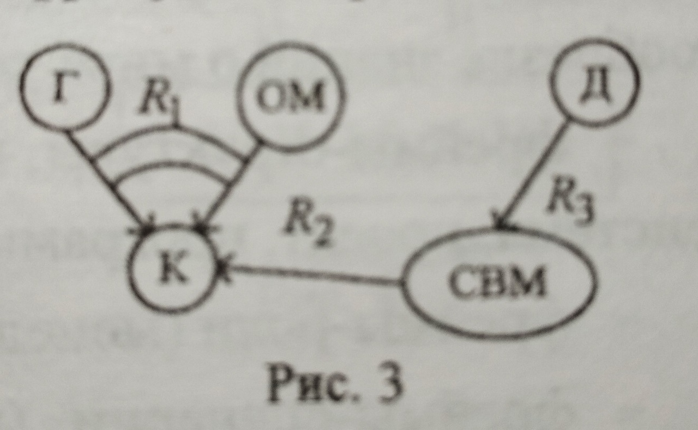

____
# Вопрос 3: Представление знаний и работа с ними. Обзор языков представления знаний
____
 
**Знания** - это закономерности предметной области (принципы, связи, законы), полученные в результате практической деятельности и проффесионального опыта, 
позволяющие спкциалистам ставить и решать задачи в этой области.
Отличительными свойствами знаний являются внутренняя интерпретируемость, структурированность, связность, активность.
Знания основаны на данных, полученных эмпирическим путём. Они представляют результат практической деятельности человека, направленной на обобщениие его опыта, 
полученного в результате практической деятельности.
**Данные** - это отдельные факты, характерезующие объекты, процессы и явления предметной области,а также значения их свойств.

По способам организации знаний и их обрвботки различают следующие основные группы методов представления: логические, продукционные, сетевые, фреймовые.

**Логические методы** представления знаний базируются на использовании понятия формальной системы, задаваемой множеством синтаксических правил, 
позволяющих строить из базовых элементов синтаксически правильные выражения, множество аксиом,множество семантических правил вывода, позволяющих расширять множество аксиом за счёт других выражений.
Наибольшее распространения в рамках этого подхода получило исчисление предикатов.

Логические методы представления знаний обеспечивают единственность теоретического обоснования системы формально точных определений и выводов, простоту и ясность
нотации для записи фактов, которая обладает чётко определений семантикой и простотой понимания.
В то же время основным недостатком логических методов является отсутствие чётких принципов организации фактов в базе знаний, что затрудняет её анализ и обработку.
Это приводит к тому, что логические методы используются в основном в тех предметных областях, где система знаний невелика по объёму и имеет однородную структуру.

Принцип работы **продукционных систем** основан на поиске путей перевода исходного состояния задачи в целевое с использованием правил продукций.
Каждое такое правило имеет вид "ЕСЛИ -условие,ТО -действие".
Анализируя текущее состояние задачи, система определяет множество продукций, "условия" которых удовлетворяют рассматриваемому состоянию, и выбирает их них одну, реализуя определяемое продукцией "действие".
Затем анализируется состояние, в которое перешла система, и выполняется следующее действие,т.е. процесс повторяется до тех пор, пока либо не найдётся продукция, "условие" которой соответствует текущему состоянию, либо не будет достигнуто целевое состояние.

Достоинство: простота создания и понимания, отдельных правил,процедуры их пополнения и модификации, а также естественность организации логического вывода.
Недостаток:  небольшое быстродействие из-за необходимости периодического сопоставления реальной ситуации с образцом - "условием".

В основе **сетевых методов** лежит представление знаний в виде множества понятий, связанных семантическими отношениями.
Графически понятия выражаются вершинами сетей, отношения - направленными дугами.

Достоинства:
-наглядное отображение взаимосвязей между объектами базы знаний
-хорошие классификационные свойства сети
-высокая смысловая выразительность сети, что обеспечивает прямое моделирование семантики предметной области и позволяет проектировщику обращаться с системой на уровне понятий профессионально -ориентированного языка
-возможность легко модифицировать представленные данные

Недостатки:
-слишком "произвольная" структура графа
-большое разнообразие типов вершин и отношений

**Пример**

Ситуация описана фразой: дом был построен на самом высоком месте узкой косы между гаванью и открытом морем.
Построен он был прочно, как корабль, и выдержал три урагана.
Обозначения: Г - гавань, ОМ - открытое море, К - коса, Д - дом, СВМ - самое высокое место.
Введём отношения: R1 - быть между, R2 - принадлежать, R3 - находиться на.
На картинке стрелки - бинарные отношения, тернарные - стрелки, стянутые дугами.

**Фреймовое представление знаний** - разновидность сетевых моделей.
Фрейм - информационная структура, описывающая конкретный стандартный фрагмент знаний (объект, ситуацию, процедуру и т.д.).
Традиционно структура фрейма:

Два последних столбца предназначены для описания способа получения слотом его значения и возможного присоединения к тому или иному слоту специальных процедур.
В качестве значения слота может выступать имя другого фрейма. что позволяет формировать сети фреймов.

Модель фрейма является  универсальной,т.к. позволяет отобразить всё многообразие знаний и мире через:
-фреймы - структуры, используемые для обозначения объектов и понятий(система, программа и др)
-фреймы - сценарии (празднование др, проведение соревнований и др)
-фреймы - ситуации (тревога, авария и др)

Достоинства:
- структурированность информации по сравнению с семантическими сетями
- более компактное представление о конкретных фактах, ситуациях и т.д.
- возможность описывать в рамках одного фрейма одновременно как декларативные(константно заданные), так процедурные(те, которые можно получить с помощью процедур).

Языки представления знаний:

(взяла из вики, у Новаковой не нашла)

- Loom. Имеет формальную семантику, которая отображает объявления в Loom на утверждения в теории множеств и логике первого порядка .
Эта формальная семантика позволяет использовать механизм проверки теорем, называемый классификатором.
Классификатор может анализировать модели Loom (известные как онтологии) и вывести различные вещи о модели.

-Пролог: основанн на языке предикатов математической логики дизъюнктов Хорна( дизъюнктивный одночлен с не более чем одним положительным литералом, н-р: L || !L1||!L2),
представляющей собой подмножество логики предикатов первого порядка.Язык сосредоточен вокруг небольшого набора основных механизмов, включая сопоставление с образцом, древовидного представления структур данных и автоматического перебора с возвратами. Хорошо подходит для решения задач, где рассматриваются объекты (в частности структурированные объекты) и отношения между ними.

Другие языки: CycL, IKL,KIF
